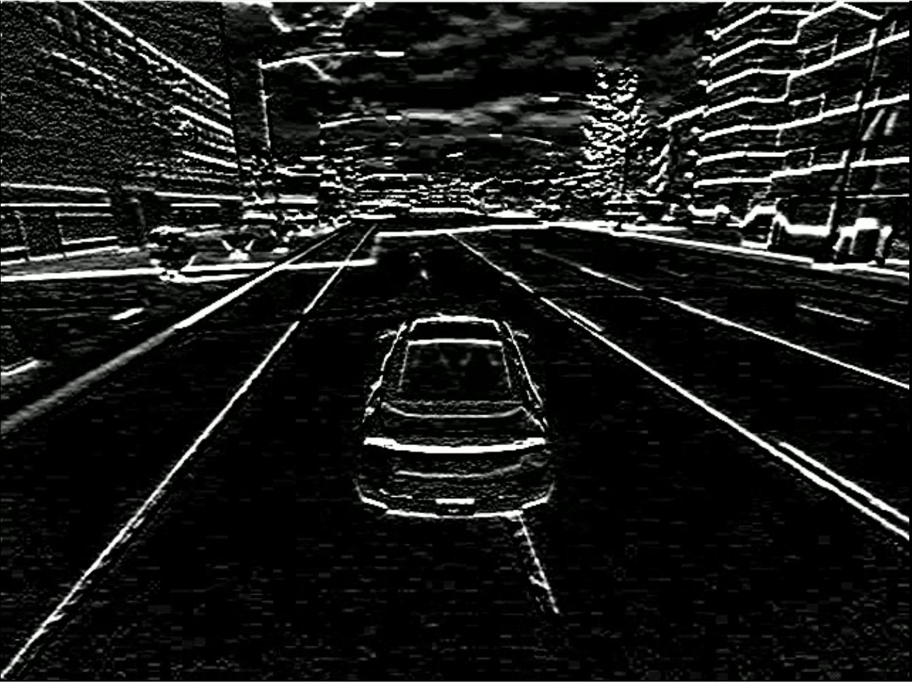

# CUDAatScaleForTheEnterpriseCourseProjectTemplate
This is the submission of **Luca Venturi** for the course project for the CUDA at Scale for the Enterprise

## Project Description
This program is intended to implement edge detection in a video, using Scharr, for example as part of a lane detection algorithm.

The program accepts two arguments:
- The input video file
- The output video file

It goes through each frame using OpenCV, then, using NPP:
- it extracts the green channel
- it applies Scharr to detect the edges
- it generates a grayscale frame, simply copying the new green channel on each RGB channels

The grayscale frame is then written to the output file.

For the allocations, the program uses 2D memory functions, which are faster when padding is required

## Building it and testing it
The program has been developed and tested on WSL, using Ubuntu 18.04.

To build it, you can use the command **make build**.

To run it, you have to supply the two arguments. You could do it in different ways, for example:
- ./run.sh
- make run ARGS="data/video.mp4 data/out.mp4"
- ./luca data/video.mp4 data/out.mp4

## Example of input


[Click here to view the input video](data/video.mp4)

## Example of output


[Click here to view the output video](data/out.mp4)

## Code Organization

```bin/```
This folder should hold all binary/executable code that is built automatically or manually. Executable code should have use the .exe extension or programming language-specific extension.

```data/```
This folder should hold all example data in any format. If the original data is rather large or can be brought in via scripts, this can be left blank in the respository, so that it doesn't require major downloads when all that is desired is the code/structure.

```lib/```
Any libraries that are not installed via the Operating System-specific package manager should be placed here, so that it is easier for inclusion/linking.

```src/```
The source code should be placed here in a hierarchical fashion, as appropriate.

```README.md```
This file should hold the description of the project so that anyone cloning or deciding if they want to clone this repository can understand its purpose to help with their decision.

```INSTALL```
This file should hold the human-readable set of instructions for installing the code so that it can be executed. If possible it should be organized around different operating systems, so that it can be done by as many people as possible with different constraints.

```Makefile or CMAkeLists.txt or build.sh```
There should be some rudimentary scripts for building your project's code in an automatic fashion.

```run.sh```
An optional script used to run your executable code, either with or without command-line arguments.